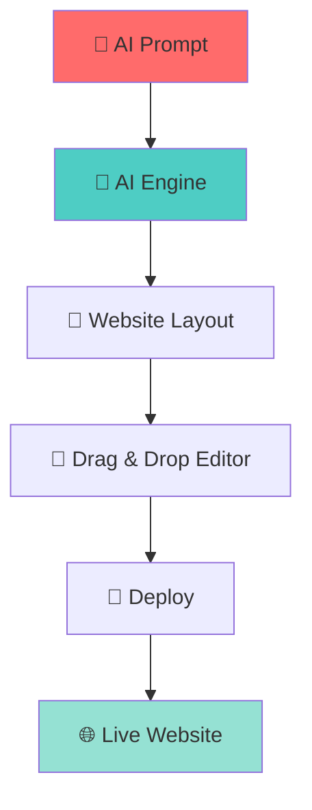
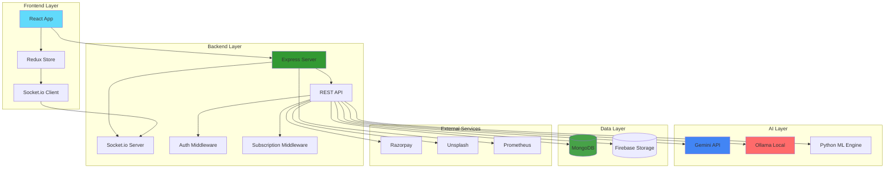

<div align="center">

# 🚀 **Sitezy.ai**

### *AI-Powered Multi-Tenant Website Builder Platform*

<p align="center">
  
  
  
  
  
</p>

<p align="center">
  <strong>Empowering organizations to create, customize, deploy, and manage stunning websites</strong><br/>
  <em>within a governed SaaS ecosystem — no coding required!</em>
</p>

<p align="center">
  <a href="#-features">Features</a> •
  <a href="#-tech-stack">Tech Stack</a> •
  <a href="#-quick-start">Quick Start</a> •
  <a href="#-architecture">Architecture</a> •
  <a href="#-demo">Demo</a>
</p>

---

</div>

## 📖 **What is Sitezy.ai?**

<table>
<tr>
<td width="60%">

**Sitezy.ai** is a next-generation **multi-tenant SaaS platform** that revolutionizes website creation through AI automation. Built for **non-technical users**, it enables multiple independent organizations to host and manage their branded websites on a unified infrastructure.

### 🎯 **The Problem We Solve**

Traditional website builders are either:
- ❌ Too complex for non-technical users
- ❌ Lack multi-tenant isolation
- ❌ Require manual design work
- ❌ Don't scale for enterprise needs

### ✅ **Our Solution**

Sitezy.ai provides **AI-assisted creation**, **complete tenant isolation**, **real-time collaboration**, and **enterprise-grade governance** — all in one platform!

</td>
<td width="40%">



</td>
</tr>
</table>

---

## ✨ **Features**

<div align="center">

### 🏢 **Multi-Tenant Architecture**

<table>
<tr>
<td align="center" width="33%">

### 🔒 **Isolation**
Complete logical separation of tenant data, assets, and branding

</td>
<td align="center" width="33%">

### 📊 **Governance**
Centralized control with subscription-based limits

</td>
<td align="center" width="33%">

### ⚡ **Scalability**
Handles thousands of tenants on shared infrastructure

</td>
</tr>
</table>

---

### 🤖 **AI-Powered Website Builder**

<table>
<tr>
<td width="50%">

#### 🎨 **Smart Layout Generation**
```javascript
// Just describe your business
"A modern coffee shop website 
 with menu, gallery, and booking"

// AI generates complete layout ✨
→ Hero Section
→ Menu Cards
→ Image Gallery
→ Booking Form
→ Contact Section
```

</td>
<td width="50%">

#### 🧠 **Intelligent Recommendations**
- 📐 Component suggestions based on business type
- 🎯 SEO-optimized content structure
- ♿ Accessibility compliance checks
- 📱 Responsive design automation

</td>
</tr>
</table>

---

### 🎨 **Visual Builder & Customization**

<table>
<tr>
<td align="center" width="25%">

#### 🖱️ **Drag & Drop**
Intuitive visual editor with real-time preview

</td>
<td align="center" width="25%">

#### 🎨 **Branding**
Global themes, colors, fonts, and logos

</td>
<td align="center" width="25%">

#### 📦 **Components**
Reusable, customizable UI blocks

</td>
<td align="center" width="25%">

#### 📱 **Responsive**
Mobile-first design automation

</td>
</tr>
</table>

---

### 🌐 **Domain & Deployment**

<table>
<tr>
<td width="50%">

#### 🔗 **Domain Management**
- 🆓 Free subdomain: `yoursite.sitezy.ai`
- 🌍 Custom domain mapping
- 🔒 SSL certificates included
- 📊 DNS configuration wizard

</td>
<td width="50%">

#### 🚀 **Deployment Pipeline**
- 📝 Draft → Preview → Production
- 🔄 Version control & rollback
- 📈 Deployment history tracking
- ⚡ One-click publishing

</td>
</tr>
</table>

---

### 👥 **Collaboration & Security**

<table>
<tr>
<td align="center" width="33%">

#### 🔐 **RBAC**
**Owner** → **Admin** → **Editor** → **Developer**

Fine-grained permission control

</td>
<td align="center" width="33%">

#### 🤝 **Real-Time Collaboration**
Multiple users editing simultaneously via **Socket.io**

</td>
<td align="center" width="33%">

#### 📜 **Version History**
Track changes and rollback instantly

</td>
</tr>
</table>

---

### 💳 **Subscription & Billing**

<table>
<tr>
<td align="center" width="25%">

#### 🆓 **Free**
1 Website<br/>
5 Pages<br/>
10 AI Prompts

</td>
<td align="center" width="25%">

#### ⭐ **Starter**
5 Websites<br/>
25 Pages<br/>
50 AI Prompts

</td>
<td align="center" width="25%">

#### 🚀 **Pro**
20 Websites<br/>
100 Pages<br/>
200 AI Prompts

</td>
<td align="center" width="25%">

#### 💎 **Enterprise**
Unlimited<br/>
Custom Limits<br/>
Priority Support

</td>
</tr>
</table>

</div>

---

## 🏆 **Brownie Points Achieved**

<div align="center">

<table>
<tr>
<td width="50%">

### 🔄 **Real-Time Collaboration**
- ✅ Socket.io-powered live editing
- ✅ Conflict resolution
- ✅ Presence indicators
- ✅ Instant synchronization

</td>
<td width="50%">

### 📊 **Observability & Monitoring**
- ✅ Prometheus metrics integration
- ✅ Usage analytics dashboard
- ✅ Resource consumption tracking
- ✅ Proactive limit warnings

</td>
</tr>
</table>

</div>

---

## 🛠️ **Tech Stack**

<div align="center">

### **Frontend**
<p>
  
  
  
  
  
</p>

### **Backend**
<p>
  
  
  
  
</p>

### **AI & ML**
<p>
  
  
  
  
</p>

### **Database & Storage**
<p>
  
  
</p>

### **DevOps & Monitoring**
<p>
  
  
</p>

### **Payment & Services**
<p>
  
  
</p>

</div>

---

## 🚀 **Quick Start**

<details open>
<summary><b>📋 Prerequisites</b></summary>

<br/>

```bash
# Required
✅ Node.js v20+
✅ MongoDB (local or Atlas)
✅ npm or yarn

# Optional
⭐ Docker (for production)
⭐ Ollama (for local AI)
```

</details>

<details open>
<summary><b>⚡ Installation</b></summary>

<br/>

### **Step 1: Clone Repository**
```bash
git clone https://github.com/yourusername/sitezy.ai.git
cd sitezy.ai
```

### **Step 2: Backend Setup**
```bash
cd backend
npm install

# Copy environment file
cp .env.example .env

# Edit .env with your credentials
# - GEMINI_API_KEY
# - MONGO_URI
# - JWT_SECRET
# - RAZORPAY_KEY_ID
# - FIREBASE credentials
```

### **Step 3: Frontend Setup**
```bash
cd frontend
npm install

# Create .env file
echo "VITE_API_URL=http://localhost:5000" > .env
```

### **Step 4: AI Engine Setup (Optional - for local AI)**
```bash
# Install Ollama
# Visit: https://ollama.ai

# Pull the model
ollama pull qwen2.5:1.5b

# Start Ollama server
ollama serve

# Start Python ML service
cd ai_engine
pip install -r requirements.txt
python ai_service.py
```

</details>

<details open>
<summary><b>🎯 Running the Application</b></summary>

<br/>

### **Development Mode**

Open **4 terminals**:

```bash
# Terminal 1: Backend
cd backend
npm start

# Terminal 2: Frontend
cd frontend
npm run dev

# Terminal 3: Ollama (optional)
ollama serve

# Terminal 4: AI Engine (optional)
cd ai_engine
python ai_service.py
```

### **Production Mode (Docker)**

```bash
# Build image
docker build -t sitezy.ai .

# Run container
docker run -d \
  --name sitezy-app \
  -p 5000:5000 \
  --env-file backend/.env \
  sitezy.ai
```

### **Access the Application**
```
🌐 Frontend: http://localhost:5173
🔧 Backend:  http://localhost:5000
🤖 AI Engine: http://localhost:5050
```

</details>

---

## 🏗️ **Architecture**

<div align="center">



</div>

---

## 📸 **Demo**

<div align="center">

### 🎨 **AI Website Generation**

<table>
<tr>
<td width="50%">

**Step 1: Describe Your Business**
```
"A modern coffee shop with 
 menu, gallery, and online ordering"
```

</td>
<td width="50%">

**Step 2: AI Generates Layout**
- ✅ Hero with coffee imagery
- ✅ Menu cards with pricing
- ✅ Photo gallery
- ✅ Order form
- ✅ Contact section

</td>
</tr>
</table>

### 🖱️ **Drag & Drop Editor**

> Customize every element with visual controls — no code needed!

### 🚀 **One-Click Deploy**

> Publish to `yoursite.sitezy.ai` or your custom domain instantly!

</div>

---

## 📊 **Project Structure**

```
sitezy.ai/
├── 📁 backend/
│   ├── 📁 src/
│   │   ├── 📁 agents/          # Firebase & deployment agents
│   │   ├── 📁 middleware/      # Auth, subscription, error handling
│   │   ├── 📁 models/          # MongoDB schemas
│   │   ├── 📁 modules/
│   │   │   ├── 📁 ai/          # AI generation logic
│   │   │   ├── 📁 analytics/   # Usage tracking
│   │   │   ├── 📁 auth/        # Authentication
│   │   │   ├── 📁 builder/     # Page builder
│   │   │   ├── 📁 domain/      # Domain management
│   │   │   ├── 📁 payment/     # Razorpay integration
│   │   │   └── 📁 website/     # Website CRUD
│   │   ├── 📁 sockets/         # Real-time collaboration
│   │   └── 📄 server.js        # Entry point
│   └── 📄 package.json
│
├── 📁 frontend/
│   ├── 📁 src/
│   │   ├── 📁 features/
│   │   │   ├── 📁 ai/          # AI generator UI
│   │   │   ├── 📁 auth/        # Login/Register
│   │   │   ├── 📁 builder/     # Visual editor
│   │   │   ├── 📁 dashboard/   # Analytics dashboard
│   │   │   └── 📁 settings/    # User settings
│   │   ├── 📁 services/        # API & Socket clients
│   │   └── 📄 main.jsx
│   └── 📄 package.json
│
├── 📁 ai_engine/
│   ├── 📄 ai_service.py        # ML layout recommender
│   ├── 📄 layout_model.pkl     # Trained model
│   └── 📄 label_encoders.pkl   # Feature encoders
│
├── 📄 Dockerfile
├── 📄 docker-compose.yml
└── 📄 README.md
```

---

## 🤝 **Contributing**

<div align="center">

We welcome contributions! Here's how you can help:

<table>
<tr>
<td align="center" width="25%">

### 🐛 **Report Bugs**
Found an issue?<br/>
[Open an Issue](https://github.com/yourusername/sitezy.ai/issues)

</td>
<td align="center" width="25%">

### 💡 **Suggest Features**
Have an idea?<br/>
[Start a Discussion](https://github.com/yourusername/sitezy.ai/discussions)

</td>
<td align="center" width="25%">

### 🔧 **Submit PRs**
Want to code?<br/>
[Fork & PR](https://github.com/yourusername/sitezy.ai/pulls)

</td>
<td align="center" width="25%">

### 📖 **Improve Docs**
Help others learn<br/>
[Edit README](https://github.com/yourusername/sitezy.ai/edit/main/README.md)

</td>
</tr>
</table>

</div>

---

## 📄 **License**

<div align="center">

This project is licensed under the **MIT License**

See [LICENSE](LICENSE) for details

</div>

---

## 🙏 **Acknowledgments**

<div align="center">

<table>
<tr>
<td align="center">

### 🤖 **AI Models**
Google Gemini<br/>
Ollama Qwen 2.5

</td>
<td align="center">

### 🎨 **Design Inspiration**
Webflow<br/>
Framer<br/>
Wix

</td>
<td align="center">

### 📚 **Libraries**
React<br/>
Express<br/>
Socket.io

</td>
<td align="center">

### 💳 **Services**
Razorpay<br/>
Firebase<br/>
Unsplash

</td>
</tr>
</table>

</div>

---

<div align="center">

## 💻 **Built With ❤️ By**

### **npm i asmr**

<p>
  
  
  
</p>

---

### ⭐ **Star this repo if you found it helpful!**

<p>
  <a href="https://github.com/yourusername/sitezy.ai/stargazers">
    
  </a>
  <a href="https://github.com/yourusername/sitezy.ai/network/members">
    
  </a>
  <a href="https://github.com/yourusername/sitezy.ai/watchers">
    
  </a>
</p>

---

**© 2026 Sitezy.ai | All Rights Reserved**

</div>
